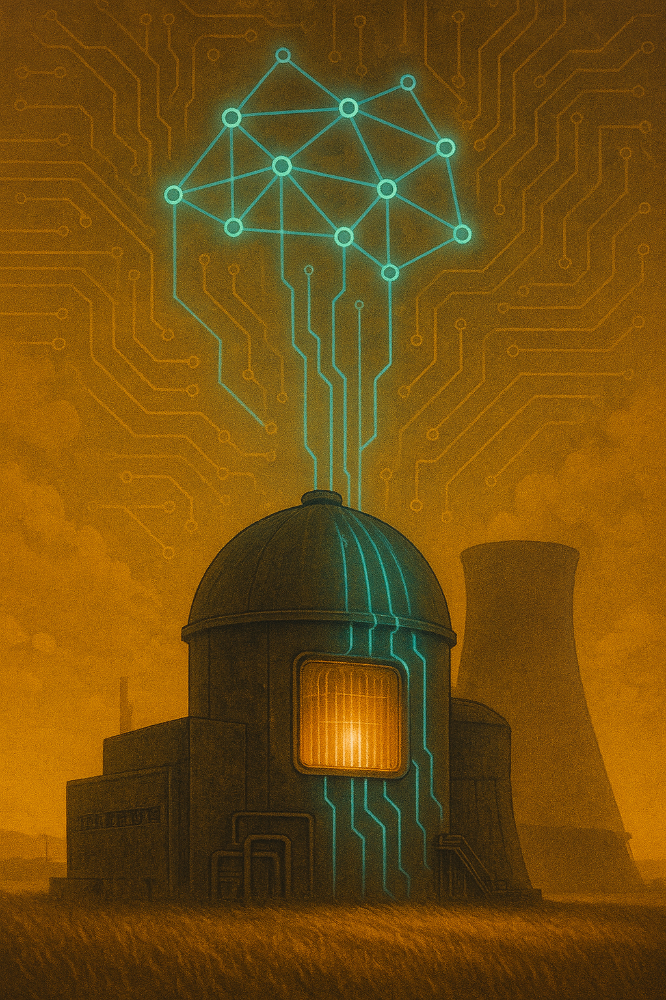

<p align="center">
  
</p>

# 🔬 Симулятор Атомного Реактора

Высокоточный симулятор атомного реактора на Python с использованием PyTorch. Включает физически корректные модели нейтронной кинетики, теплообмена и систему управления.

## 📋 Возможности

- **Нейтронная кинетика**: Уравнения точечной кинетики с 6 группами запаздывающих нейтронов
- **Тепловая модель**: Трехузловая модель (топливо, оболочка, теплоноситель)
- **Система управления**: Управляющие стержни с ручным и автоматическим (ПИД) управлением
- **Обратные связи**: Доплеровский эффект и температурная обратная связь по теплоносителю
- **Безопасность**: Мониторинг предельных значений и аварийная остановка (SCRAM)
- **Визуализация**: Графики в реальном времени и отчеты о симуляции

## 🚀 Установка

```bash
# Клонировать репозиторий
cd atomic-sim

# Установить зависимости
pip install -r requirements.txt
```

### Требования

- Python 3.8+
- PyTorch 2.0+
- NumPy 1.24+
- Matplotlib 3.7+
- SciPy 1.10+

## 📖 Быстрый старт

### Базовая симуляция

```python
from reactor import ReactorSimulator
from reactor.visualization import plot_simulation_results

# Создание симулятора
simulator = ReactorSimulator(device='cpu')

# Запуск симуляции на 60 секунд
history = simulator.run(duration=60.0)

# Визуализация результатов
plot_simulation_results(history, save_path="results.png")
```

### Автоматическое управление мощностью

```python
# Включение ПИД-регулятора
simulator.set_auto_control(enabled=True, target_power=150.0)

# Запуск симуляции
history = simulator.run(duration=100.0)
```

### Ручное управление

```python
# Пошаговое управление
simulator.start_recording()

# Извлечение стержней (увеличение мощности)
for i in range(1000):
    simulator.step(manual_rod_direction=1)

# Вставление стержней (снижение мощности)
for i in range(1000):
    simulator.step(manual_rod_direction=-1)

# Получение истории
history = simulator.get_history()
```

### Аварийная остановка

```python
# Проверка безопасности
state = simulator.get_state()
if state['T_fuel'] > 900.0:
    simulator.scram()  # Аварийная остановка
```

## 🧪 Примеры

В директории `examples/` представлены детальные примеры:

### 1. Базовая симуляция
```bash
cd examples
python basic_simulation.py
```
Демонстрирует основные функции симулятора без активного управления.

### 2. Автоматическое управление
```bash
python auto_control.py
```
Показывает работу ПИД-регулятора для поддержания заданной мощности.

### 3. Ручное управление
```bash
python manual_control.py
```
Пример ручного управления управляющими стержнями.

### 4. Аварийная ситуация
```bash
python emergency_scram.py
```
Симуляция потери охлаждения и аварийной остановки реактора.

## 📚 Документация

### Основные компоненты

#### ReactorSimulator
Главный класс симулятора, объединяющий все подсистемы.

```python
simulator = ReactorSimulator(device='cpu', dtype=torch.float64)
```

**Методы:**
- `reset()`: Сброс к начальному состоянию
- `step(manual_rod_direction, external_reactivity)`: Один шаг симуляции
- `run(duration, callback, callback_interval)`: Запуск на заданное время
- `get_state()`: Получить текущее состояние
- `get_history()`: Получить историю симуляции
- `print_state()`: Вывести состояние в консоль

**Управление:**
- `set_auto_control(enabled, target_power)`: Включить/выключить автоматическое управление
- `scram()`: Аварийная остановка
- `set_coolant_flow(flow_rate)`: Установить расход теплоносителя

#### NeutronKinetics
Модель нейтронной кинетики реактора.

**Уравнения:**
```
dn/dt = (ρ - β)/Λ * n + Σ λᵢ * Cᵢ
dCᵢ/dt = βᵢ/Λ * n - λᵢ * Cᵢ
```

**Параметры:**
- 6 групп запаздывающих нейтронов
- Время жизни мгновенных нейтронов: Λ = 5×10⁻⁵ с
- Общая доля запаздывающих нейтронов: β ≈ 0.0065

#### ThermalModel
Тепловая модель с тремя узлами.

**Узлы:**
- Топливо (максимальная температура: 1200°C)
- Оболочка
- Теплоноситель (максимальная температура: 320°C)

**Обратные связи:**
- Доплеровский эффект: αfuel = -5×10⁻⁵ β/K
- Температура теплоносителя: αcoolant = -3×10⁻⁵ β/K

#### ControlSystem
Система управления с управляющими стержнями.

**Характеристики:**
- 10 управляющих стержней
- Реактивность одного стержня: -2.0β
- Скорость движения: 0.05 (относительных единиц/с)
- ПИД-регулятор с настраиваемыми коэффициентами

### Визуализация

```python
from reactor.visualization import (
    plot_simulation_results,
    plot_phase_space,
    create_summary_report
)

# График временных рядов
plot_simulation_results(history, title="Моя симуляция", save_path="plot.png")

# Фазовое пространство
plot_phase_space(history, save_path="phase.png")

# Текстовый отчет
report = create_summary_report(history)
print(report)
```

## 🔬 Физическая модель

### Точечная кинетика

Симулятор использует классические уравнения точечной кинетики реактора с учетом 6 групп предшественников запаздывающих нейтронов. Это стандартная модель для описания динамики ядерного реактора.

### Тепловая модель

Трехузловая модель теплопередачи учитывает:
- Генерацию тепла в топливе
- Теплопередачу через оболочку
- Охлаждение теплоносителем
- Температурные обратные связи

### Обратные связи

Система включает отрицательные обратные связи по температуре:
- **Доплеровский эффект**: Увеличение температуры топлива расширяет резонансы захвата, снижая реактивность
- **Температура теплоносителя**: Нагрев воды снижает её плотность, уменьшая замедление нейтронов

## ⚙️ Параметры и настройки

### Изменение параметров реактора

```python
# Доступ к подсистемам
simulator.neutronics.Lambda = torch.tensor(1e-4)  # Изменить время жизни нейтронов
simulator.thermal.C_fuel = torch.tensor(25.0)  # Изменить теплоемкость топлива
simulator.control.rod_speed = torch.tensor(0.1)  # Изменить скорость стержней
```

### Настройка ПИД-регулятора

```python
simulator.control.Kp = torch.tensor(0.2)  # Пропорциональный коэффициент
simulator.control.Ki = torch.tensor(0.02)  # Интегральный коэффициент
simulator.control.Kd = torch.tensor(0.1)  # Дифференциальный коэффициент
```

## 🎯 Сценарии использования

### 1. Обучение и образование
Симулятор идеален для изучения физики реакторов и динамики ядерных процессов.

### 2. Разработка систем управления
Тестирование алгоритмов управления мощностью реактора.

### 3. Анализ аварийных ситуаций
Исследование поведения реактора в нештатных ситуациях.

### 4. Машинное обучение
Использование PyTorch позволяет интегрировать ML-модели для оптимизации управления.

## 🛡️ Безопасность

Симулятор включает систему мониторинга безопасности:

- **Температура топлива**: Предел 1200°C
- **Температура теплоносителя**: Предел 320°C (кипение под давлением)
- **Автоматический SCRAM**: При превышении критических значений

## 📊 Выходные данные

### Состояние реактора

```python
state = simulator.get_state()
# {
#     'time': 10.5,
#     'power': 142.3,
#     'neutron_density': 1.423,
#     'T_fuel': 650.2,
#     'T_clad': 360.1,
#     'T_coolant': 305.3,
#     'rod_reactivity': -0.234,
#     'avg_rod_position': 0.75,
#     'safe': True,
#     ...
# }
```

### История симуляции

```python
history = simulator.get_history()
# {
#     'time': array([...]),
#     'power': array([...]),
#     'reactivity': array([...]),
#     'T_fuel': array([...]),
#     'T_coolant': array([...]),
#     'rod_position': array([...])
# }
```

## 🤝 Вклад в проект

Приветствуются предложения по улучшению! Для внесения изменений:

1. Форкните репозиторий
2. Создайте ветку для новой функции
3. Внесите изменения и добавьте тесты
4. Отправьте pull request

## 📄 Лицензия

См. файл [LICENSE](LICENSE) для деталей.

## 🔗 Ссылки и литература

### Рекомендуемая литература:
1. Duderstadt J.J., Hamilton L.J. "Nuclear Reactor Analysis" (1976)
2. Hetrick D.L. "Dynamics of Nuclear Reactors" (1993)
3. Glasstone S., Sesonske A. "Nuclear Reactor Engineering" (1994)

### Стандарты:
- IAEA Safety Standards for Nuclear Reactors
- DOE Nuclear Safety Technical Standards

## 💡 Примечания

⚠️ **Дисклеймер**: Этот симулятор создан в образовательных целях. Он использует упрощенные модели и не должен применяться для проектирования реальных ядерных установок без надлежащей валидации и экспертизы.

## 📞 Контакты

Для вопросов и предложений создайте issue в репозитории проекта.

---

**Разработано с использованием PyTorch 🔥**

